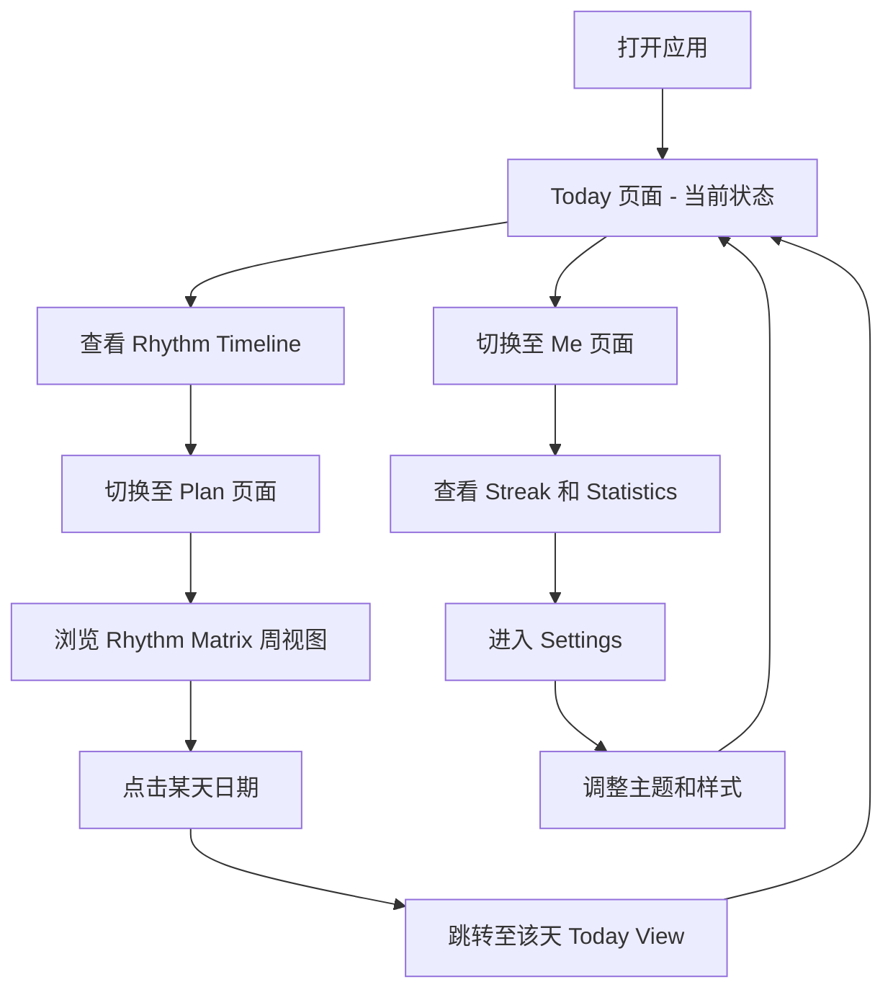
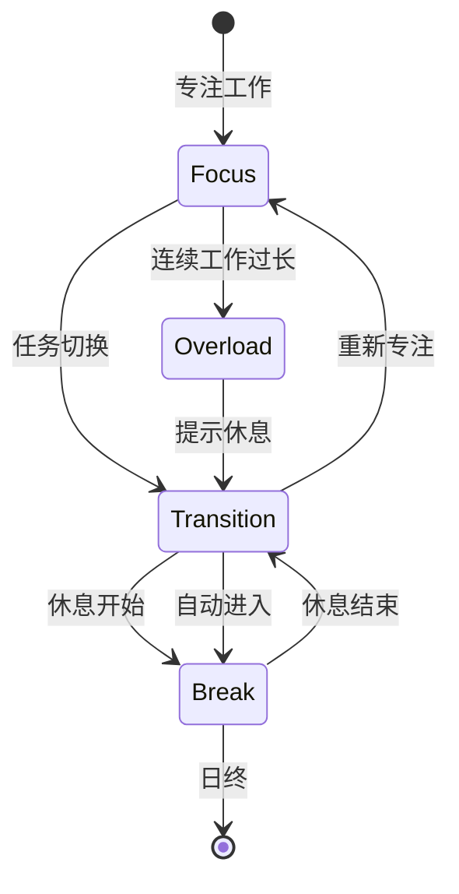

# Rhythm Plan System - 产品需求文档

## 1. 产品概述

一款专为个人节奏管理设计的移动端 Web 应用，通过可视化的时间环和情感化界面，帮助用户追踪一天中的专注、休息、过渡和过载状态，实现工作与生活的动态平衡。

### 核心价值
- 沉浸式当前状态展示，让用户一眼看穿今日节奏
- 周视角矩阵布局，告别传统冷淡日历
- 柔和动画与情感化设计，拒绝企业仪表盘感

### 目标用户
- 需要平衡工作与休息的知识工作者
- 希望优化个人时间节奏的用户
- 追求情感化、美学化界面体验的人群

## 2. 核心功能

### 2.1 页面结构

| 页面 | 核心模块 | 功能描述 |
|------|---------|---------|
| **Today（首页）** | 当前状态展示 | 沉浸式角色状态显示 |
|  | Rhythm Timeline | 24小时时间轴，高亮当前时段 |
|  | Countdown | 当前时段剩余时间 |
|  | Next State Preview | 下一个状态预览 |
| **Plan（计划）** | Rhythm Matrix View | 周视图矩阵（替代传统日历） |
|  | Daily Rhythm Ring | 每日节奏环，可视化一天结构 |
|  | 日期交互 | 点击日期跳转至当日 Today View |
| **Me（个人）** | 用户信息 | 角色、主题显示 |
|  | Streak 追踪 | 连续记录天数 |
|  | Statistics | 使用统计数据 |
| **Settings（设置）** | Theme Color | 主题颜色选择 |
|  | UI Theme Style | 界面风格切换 |
|  | Character Style | 角色样式选择 |

### 2.2 底部导航栏

- **布局**: 固定在底部，三个按钮均分
- **按钮**: Today / Plan / Me
- **样式**: 大圆角 soft floating bar
- **交互**: 当前页高亮，切换时柔和动画

### 2.3 Daily Rhythm Ring（节奏环）

**视觉构成**:
- 圆环由不同颜色片段组成
- 片段长度 = 时间占比
- 颜色定义：
  - **黄色 (Yellow)**: Focus - 专注时段
  - **绿色 (Green)**: Break - 休息时段
  - **紫色 (Purple)**: Transition - 过渡时段
  - **红色 (Red)**: Overload - 过载时段

**目标**: 一眼看出"一天的节奏结构"

### 2.4 Rhythm Timeline（时间轴）

**功能**:
- 24小时横向或纵向时间轴
- 不同状态以颜色区分
- 当前时段高亮显示
- 显示时段标签和时长

## 3. 用户流程

### 3.1 核心用户路径

### 3.2 状态流转

## 4. 界面设计规范

### 4.1 设计风格

**整体调性**: Soft / Emotional / Alive / Rhythm-driven

**核心原则**:
- ✗ 禁止：企业 dashboard 感
- ✗ 禁止：复杂数据面板
- ✗ 禁止：冷淡 calendar UI
- ✓ 要求：柔和、情感化、富有生命力

### 4.2 色彩系统

| 用途 | 颜色名称 | Hex 值 | 应用场景 |
|------|---------|--------|---------|
| 专注 | Warm Yellow | `#f5a623` | Focus 状态、强调色 |
| 休息 | Soft Green | `#5a9a8a` | Break 状态、放松氛围 |
| 过渡 | Gentle Purple | `#8a7aaa` | Transition 状态、柔和过渡 |
| 过载 | Soft Red | `#d94a4a` | Overload 状态、警示 |
| 背景 | Warm Cream | `#f5f3f0` | 主背景色 |
| 卡片 | Pure White | `#ffffff` | 卡片背景（80% 透明） |
| 文字 | Deep Gray | `#3a3a3a` | 主文字 |
| 辅助文字 | Soft Gray | `#9a9a9a` | 次要文字 |

### 4.3 字体规范

| 用途 | 字体 | 备选 |
|------|------|------|
| 标题/数字 | Orbitron (数字感) | monospace |
| 日文/正文 | Noto Sans JP | sans-serif |
| 英文标签 | System Default | - |

### 4.4 圆角规范

- **按钮**: `rounded-full` (全圆角)
- **卡片**: `rounded-2xl` (大圆角)
- **底部导航**: `rounded-full` (胶囊形)

### 4.5 动画规范

**入场动画**:
- 页面切换: 淡入 + 轻微上移，duration: 0.6s
- 卡片: 依次淡入，stagger 0.1s

**状态动画**:
- Focus: 轻微呼吸缩放 (scale 1 → 1.02 → 1)
- Break: 漂浮上下 (translateY 0 → -8 → 0)
- Overload: 轻微抖动 (x -2 → 2)
- Transition: 轻微旋转 (rotate 0 → 3 → -3 → 0)

**切换动画**:
- 页面切换: 柔和淡入淡出
- Tab 切换: 图标缩放 + 颜色渐变

### 4.6 阴影与光效

- **卡片阴影**: `shadow-lg`，柔和扩散
- **角色球阴影**: 多层阴影 + 外发光
- **背景装饰**: 大型模糊圆球，营造深度感

## 5. 响应式设计

### 5.1 移动端优先

- **目标设备**: 手机浏览器 (iOS Safari, Android Chrome)
- **最大宽度**: 428px (iPhone 14 Pro Max)
- **安全区域**: 考虑刘海屏和圆角屏

### 5.2 触摸优化

- **点击区域**: 最小 44x44px
- **手势**: 支持点击切换页面
- **滚动**: 平滑滚动，自然惯性

### 5.3 底部导航适配

- **高度**: 固定 64px
- **内边距**: 底部增加 safe-area-inset-bottom
- **位置**: 始终固定在视口底部

## 6. 技术约束

### 6.1 性能要求

- **首屏加载**: < 2s
- **动画帧率**: 60fps
- **包体积**: < 500KB (gzip)

### 6.2 兼容性

- **最低支持**: iOS 12+, Android 8+
- **浏览器**: Chrome 90+, Safari 14+, Firefox 88+

### 6.3 可访问性

- **对比度**: 文字与背景对比度 ≥ 4.5:1
- **焦点可见**: 支持键盘导航
- **屏幕阅读**: 语义化 HTML 结构

## 7. 第一阶段范围

### 7.1 MVP 功能 (当前版本)

1. ✅ 底部导航栏 (Today/Plan/Me)
2. ✅ Today 页面完整功能
3. ✅ Plan 页面 Rhythm Matrix View
4. ✅ Daily Rhythm Ring 组件
5. ✅ Me 页面基础信息
6. ✅ Settings 页面 (主题颜色、UI风格、角色样式)

### 7.2 后续扩展 (未来版本)

- [ ] 数据持久化 (localStorage)
- [ ] 用户自定义节奏块
- [ ] 历史数据查看
- [ ] 周报/月报生成
- [ ] 通知提醒功能
- [ ] 深色模式
- [ ] 多语言支持
