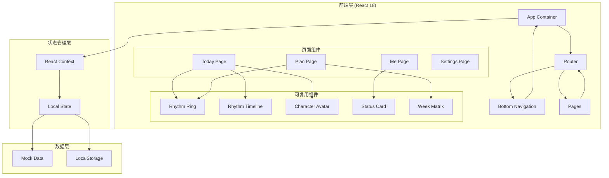
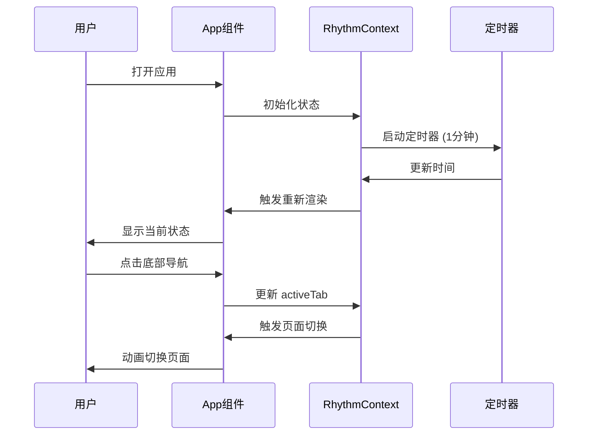

# Rhythm Plan System - 技术架构文档

## 1. 架构设计

### 1.1 系统架构图



### 1.2 技术栈

| 层级 | 技术 | 版本 | 用途 |
|------|------|------|------|
| **框架** | React | 18.3.1 | UI 框架 |
| **构建** | Vite | 5.4.1 | 快速开发构建 |
| **样式** | Tailwind CSS | 3.4.4 | 原子化 CSS |
| **动画** | Framer Motion | 11.0.0 | 流畅动画 |
| **字体** | Noto Sans JP | CDN | 日文字体 |
| **字体** | Orbitron | CDN | 数字字体 |

### 1.3 项目结构

```
/workspace/
├── src/
│   ├── components/
│   │   ├── navigation/
│   │   │   └── BottomNav.jsx          # 底部导航栏
│   │   ├── rhythm/
│   │   │   ├── RhythmRing.jsx       # 每日节奏环
│   │   │   ├── RhythmTimeline.jsx    # 时间轴
│   │   │   └── RhythmMatrix.jsx      # 周矩阵
│   │   ├── character/
│   │   │   └── CharacterAvatar.jsx  # 角色头像
│   │   └── common/
│   │       ├── StatusCard.jsx        # 状态卡片
│   │       └── FloatingCard.jsx      # 浮动卡片
│   ├── pages/
│   │   ├── TodayPage.jsx             # 今日页面
│   │   ├── PlanPage.jsx              # 计划页面
│   │   ├── MePage.jsx                # 个人页面
│   │   └── SettingsPage.jsx          # 设置页面
│   ├── context/
│   │   └── RhythmContext.jsx         # 全局状态管理
│   ├── data/
│   │   └── mockData.js                # 模拟数据
│   ├── utils/
│   │   └── timeUtils.js               # 时间工具函数
│   ├── App.jsx                        # 主应用组件
│   ├── main.jsx                       # 入口文件
│   └── index.css                      # 全局样式
├── public/
├── index.html
├── package.json
├── tailwind.config.js
├── vite.config.js
└── postcss.config.js
```

## 2. 路由设计

### 2.1 路由定义

| 路径 | 页面 | 描述 |
|------|------|------|
| `/` | TodayPage | 今日页面（默认首页） |
| `/plan` | PlanPage | 计划页面（周视图） |
| `/me` | MePage | 个人页面 |
| `/settings` | SettingsPage | 设置页面 |

### 2.2 路由实现

**方案**: 状态驱动型路由（避免额外依赖）

```jsx
// 简单的状态管理路由
const [currentPage, setCurrentPage] = useState('today')

// 渲染逻辑
{currentPage === 'today' && <TodayPage />}
{currentPage === 'plan' && <PlanPage />}
{currentPage === 'me' && <MePage />}
{currentPage === 'settings' && <SettingsPage />}
```

**优势**:
- 无需 react-router-dom 依赖
- 页面切换流畅（Framer Motion 动画）
- 轻量级，适合单页应用

## 3. 组件设计

### 3.1 BottomNav (底部导航栏)

**职责**: 全局导航切换

**Props**:
```typescript
interface BottomNavProps {
  activeTab: 'today' | 'plan' | 'me'
  onTabChange: (tab: string) => void
}
```

**样式**:
- 位置: 固定底部
- 高度: 64px + safe-area
- 形状: 胶囊形 (rounded-full)
- 背景: 白色半透明 + 毛玻璃效果
- 阴影: 柔和向上阴影

**状态**:
- Default: 图标 + 文字，颜色淡
- Active: 放大图标 + 高亮颜色 + 背景高亮

### 3.2 RhythmRing (节奏环)

**职责**: 可视化一天的时间结构

**Props**:
```typescript
interface RhythmRingProps {
  blocks: Array<{
    type: 'focus' | 'break' | 'transition' | 'overload'
    start: string
    end: string
  }>
  size?: number
  showLabels?: boolean
}
```

**实现细节**:
- 使用 SVG 绘制圆环
- 每个 block 根据时间占比计算弧度
- 颜色映射: focus=yellow, break=green, transition=purple, overload=red
- 动画: 加载时依次展开

**颜色映射**:
```javascript
const TYPE_COLORS = {
  focus: '#f5a623',
  break: '#5a9a8a',
  transition: '#8a7aaa',
  overload: '#d94a4a'
}
```

### 3.3 RhythmTimeline (时间轴)

**职责**: 展示 24 小时时间段

**Props**:
```typescript
interface RhythmTimelineProps {
  blocks: Array<RhythmBlock>
  currentTime: Date
  onBlockClick?: (block: RhythmBlock) => void
}
```

**布局**:
- 垂直时间轴
- 每个 block 显示: 时间范围、标签、颜色
- 当前时间高亮 + 脉冲动画
- 未来时间淡化显示

### 3.4 RhythmMatrix (节奏矩阵)

**职责**: 周视图矩阵展示

**Props**:
```typescript
interface RhythmMatrixProps {
  weekStart: Date
  rhythmData: Array<{
    date: string
    blocks: Array<RhythmBlock>
  }>
  onDateClick: (date: string) => void
}
```

**布局**:
- 7列网格 (周一到周日)
- 每格显示: 日期 + Rhythm Ring (缩小版)
- 点击跳转到对应日期的 Today View

### 3.5 CharacterAvatar (角色头像)

**职责**: 情感化状态展示

**Props**:
```typescript
interface CharacterAvatarProps {
  state: 'focus' | 'break' | 'transition' | 'overload'
  size?: 'sm' | 'md' | 'lg'
  animated?: boolean
}
```

**状态表情**:
```javascript
const CHARACTER_STATES = {
  focus: { emoji: '😊', face: '╭(◔▽◔)╮', label: 'Calm Focus' },
  break: { emoji: '😌', face: '(◕‿◕)', label: 'Relaxed' },
  transition: { emoji: '🤔', face: '(・_・)', label: 'Shifting' },
  overload: { emoji: '😵', face: '(°o°)', label: 'Overload' }
}
```

**动画**:
- Focus: 轻微呼吸缩放
- Break: 漂浮上下
- Transition: 轻微旋转
- Overload: 抖动

## 4. 数据模型

### 4.1 核心数据结构

```typescript
// 节奏块
interface RhythmBlock {
  id: string
  start: string      // "HH:MM"
  end: string        // "HH:MM"
  label: string       // "日语学习"
  type: 'focus' | 'break' | 'transition' | 'overload'
}

// 日计划
interface DayRhythm {
  date: string        // "YYYY-MM-DD"
  blocks: RhythmBlock[]
}

// 用户设置
interface UserSettings {
  theme: 'warm' | 'cool' | 'dark'
  uiStyle: 'soft' | 'minimal' | 'playful'
  characterStyle: 'default' | 'minimal' | 'emoji'
}

// 用户统计
interface UserStats {
  currentStreak: number
  longestStreak: number
  totalFocusHours: number
  weeklyData: number[]
}
```

### 4.2 Mock Data 示例

```javascript
const RHYTHM_BLOCKS = [
  { start: '06:00', end: '06:30', label: '起床', type: 'transition' },
  { start: '06:30', end: '08:00', label: '早间准备', type: 'break' },
  { start: '08:00', end: '10:00', label: '日语学习', type: 'focus' },
  { start: '10:00', end: '10:30', label: 'coffee break', type: 'break' },
  // ...
]

const WEEK_DATA = [
  { date: '2024-01-15', blocks: [...], dayOfWeek: 'Mon' },
  { date: '2024-01-16', blocks: [...], dayOfWeek: 'Tue' },
  // ...
]
```

## 5. 状态管理

### 5.1 Context API

```javascript
// RhythmContext.jsx
export const RhythmProvider = ({ children }) => {
  const [currentDate, setCurrentDate] = useState(new Date())
  const [currentBlock, setCurrentBlock] = useState(null)
  const [settings, setSettings] = useState(defaultSettings)
  const [activeTab, setActiveTab] = useState('today')

  // 计算当前时间段
  const updateCurrentBlock = useCallback(() => {
    const now = new Date()
    const h = String(now.getHours()).padStart(2, '0')
    const m = String(now.getMinutes()).padStart(2, '0')
    const time = `${h}:${m}`
    
    // 遍历 blocks 查找匹配
    // ...
  }, [])

  return (
    <RhythmContext.Provider value={{
      currentDate,
      setCurrentDate,
      currentBlock,
      settings,
      setSettings,
      activeTab,
      setActiveTab
    }}>
      {children}
    </RhythmContext.Provider>
  )
}
```

### 5.2 状态流转



## 6. 工具函数

### 6.1 时间工具

```javascript
// timeUtils.js

// 时间字符串转分钟数
export function timeToMinutes(timeStr) {
  const [h, m] = timeStr.split(':').map(Number)
  return h * 60 + m
}

// 分钟数转时间字符串
export function minutesToTime(minutes) {
  const h = Math.floor(minutes / 60)
  const m = minutes % 60
  return `${String(h).padStart(2, '0')}:${String(m).padStart(2, '0')}`
}

// 计算时间差（分钟）
export function timeDifference(start, end) {
  return timeToMinutes(end) - timeToMinutes(start)
}

// 判断当前时间是否在区间内
export function isTimeInRange(time, start, end) {
  const t = timeToMinutes(time)
  const s = timeToMinutes(start)
  const e = timeToMinutes(end)
  return t >= s && t < e
}

// 计算时间占比
export function calculateRatio(start, end) {
  const duration = timeDifference(start, end)
  return duration / (24 * 60)  // 相对于一天
}

// 格式化剩余时间
export function formatRemainingTime(minutes) {
  if (minutes <= 0) return '0 min'
  if (minutes < 60) return `${minutes} min`
  return `${Math.floor(minutes / 60)}h ${minutes % 60}m`
}
```

### 6.2 日期工具

```javascript
// 获取一周的日期
export function getWeekDates(date) {
  const week = []
  const start = getMonday(date)
  
  for (let i = 0; i < 7; i++) {
    const d = new Date(start)
    d.setDate(start.getDate() + i)
    week.push(d)
  }
  
  return week
}

// 获取周一
export function getMonday(date) {
  const d = new Date(date)
  const day = d.getDay()
  const diff = d.getDate() - day + (day === 0 ? -6 : 1)
  d.setDate(diff)
  return d
}

// 格式化日期
export function formatDate(date, format = 'YYYY-MM-DD') {
  const y = date.getFullYear()
  const m = String(date.getMonth() + 1).padStart(2, '0')
  const d = String(date.getDate()).padStart(2, '0')
  
  return format
    .replace('YYYY', y)
    .replace('MM', m)
    .replace('DD', d)
}
```

## 7. 性能优化

### 7.1 首屏优化

**策略**:
- Vite 构建优化 (code splitting)
- 图片懒加载
- 字体预加载 (Noto Sans JP, Orbitron)

**实现**:
```html
<!-- index.html -->
<link rel="preconnect" href="https://fonts.googleapis.com">
<link rel="preconnect" href="https://fonts.gstatic.com" crossorigin>
<link href="https://fonts.googleapis.com/css2?family=Noto+Sans+JP:wght@400;500;700&family=Orbitron:wght@400;700&display=swap" rel="stylesheet">
```

### 7.2 动画优化

**策略**:
- 使用 CSS transform (GPU 加速)
- will-change 属性优化
- 避免重绘和重排

**示例**:
```css
.character-ball {
  will-change: transform;
  transform: translateZ(0);
}
```

### 7.3 状态更新优化

**策略**:
- 使用 useMemo 缓存计算结果
- useCallback 稳定函数引用
- 避免不必要的重新渲染

**示例**:
```javascript
const currentBlock = useMemo(() => {
  return RHYTHM_BLOCKS.find(block => isTimeInRange(currentTime, block.start, block.end))
}, [currentTime])

const handleTabChange = useCallback((tab) => {
  setActiveTab(tab)
}, [])
```

## 8. 可访问性 (A11y)

### 8.1 语义化结构

```jsx
<main>
  <header>
    <h1>页面标题</h1>
  </header>
  
  <section aria-label="主要内容">
    {/* 内容 */}
  </section>
  
  <nav aria-label="底部导航">
    <BottomNav />
  </nav>
</main>
```

### 8.2 焦点管理

```jsx
// 页面切换时聚焦到主要内容
useEffect(() => {
  const mainContent = document.getElementById('main-content')
  if (mainContent) {
    mainContent.focus()
  }
}, [activeTab])
```

### 8.3 屏幕阅读器支持

```jsx
// 动态内容添加 aria-live
<div aria-live="polite" className="sr-only">
  {currentState && `当前状态: ${currentState.label}`}
</div>
```

## 9. 测试策略

### 9.1 功能测试

- [ ] 底部导航切换正常
- [ ] Today 页面时间更新
- [ ] Plan 页面周视图正确
- [ ] Rhythm Ring 渲染正确
- [ ] 设置保存生效

### 9.2 视觉测试

- [ ] 动画流畅度 (60fps)
- [ ] 响应式布局适配
- [ ] 颜色对比度合规
- [ ] 字体加载正常

### 9.3 兼容性测试

- [ ] iOS Safari
- [ ] Android Chrome
- [ ] 桌面浏览器 (开发调试)

## 10. 部署架构

### 10.1 静态部署

**方案**: Vite build 生成静态文件

```bash
npm run build
# 输出到 dist/ 目录
```

**部署位置**:
- Vercel
- Netlify
- GitHub Pages
- 任意静态服务器

### 10.2 CI/CD 流程

```yaml
# .github/workflows/deploy.yml
name: Deploy

on:
  push:
    branches: [main]

jobs:
  deploy:
    runs-on: ubuntu-latest
    steps:
      - uses: actions/checkout@v2
      - uses: actions/setup-node@v1
        with:
          node-version: '18'
      - run: npm install
      - run: npm run build
      - uses: peaceiris/actions-gh-pages@v3
        with:
          github_token: ${{ secrets.GITHUB_TOKEN }}
          publish_dir: ./dist
```

## 11. 未来扩展

### 11.1 数据持久化

**选项**:
1. LocalStorage (当前)
2. IndexedDB (复杂数据)
3. 后端 API + 数据库

### 11.2 实时同步

**场景**:
- 多设备同步
- 团队协作

**方案**:
- Firebase Realtime Database
- Supabase
- 自建 WebSocket 服务

### 11.3 通知系统

**功能**:
- 休息提醒
- 专注计时
- 日程同步

**实现**:
- Web Push API
- Service Worker
- 第三方推送服务
